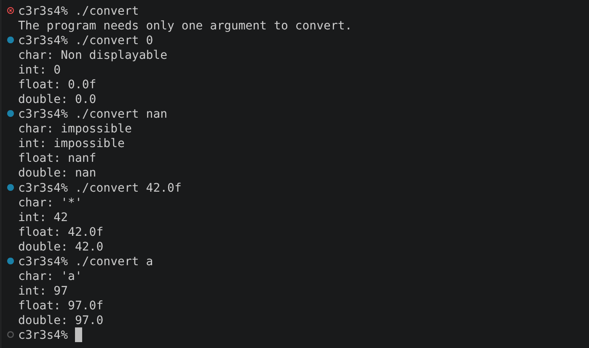
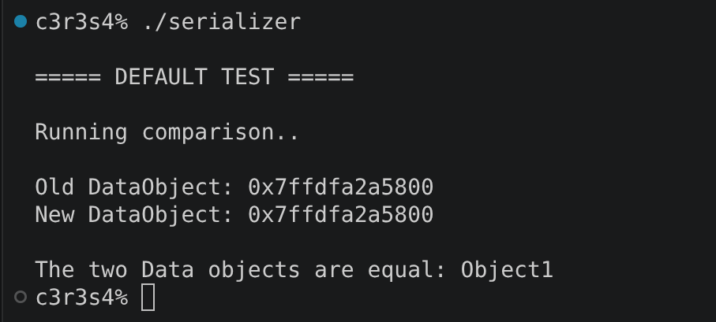
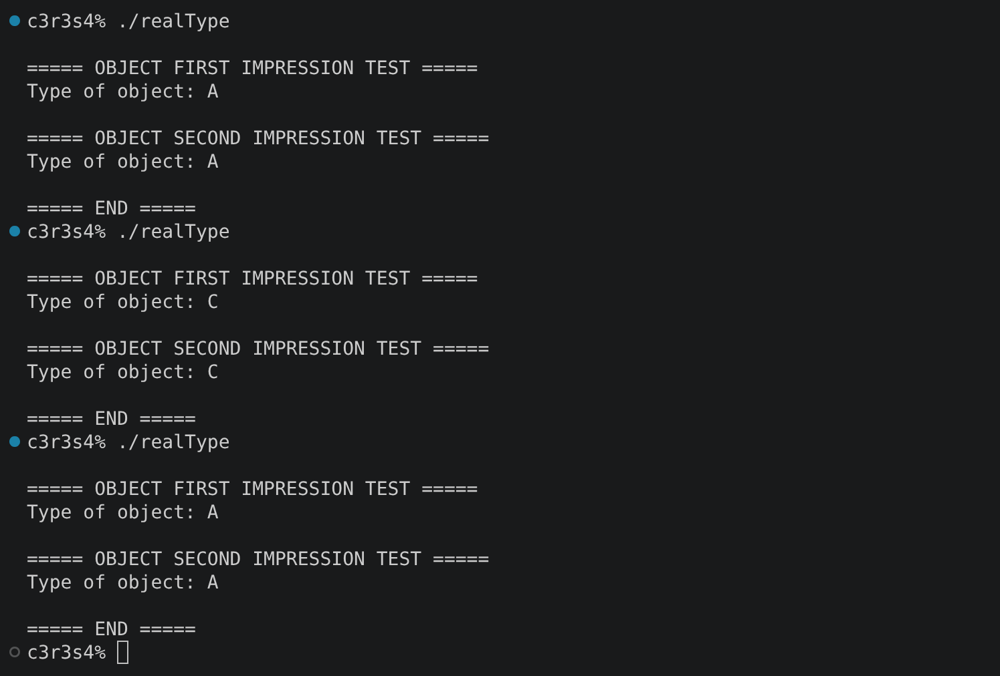

# cpp_module_06

### Clarifications and general tips:

* If you find any kind of error or have suggestions to improve, please do not hesitate to point them out in the `issues` section! Obviously always respectfully, thank you :D.
* Always remember that the output examples are just examples. They can vary in your own project and still be fine.

## ex00: Conversion of scalar types

### Mandatory requirements completed:

* Create a `ScalarConverter` class that:
  * Has a *static* method `convert`:
    * It takes a string that represents a literal in c++ in its most common form.
    * It returns the literal displayed as:
      * `char`
      * `int`
      * `float`
      * `double`
    * Only uses *decimal* notation, except for `char` parameters.
    * It cannot use non-displayable characters as inputs. If the conversion to `char` produces a non-displayable character, it prints an informative message: `Non displayable`.
  * Can´t be instantiable by users.
* The program *detects* the literal parameter, *converts* it to its *true type* and then converts it to the other *three* data types. Finally, all the results are shown below.
* **WARNING:** Not all floats are displayable. Sometimes when a huge float is passed as parameter, the result seems wrong because it is technically impossible to display.

### What can we learn about this exercise?:

The purpose of this exercise is to understand how **scalar type conversion** works in C++ and how a literal represented as a string can be converted into different scalar types.

### Output example:

## ex01: Serialization

### Mandatory requirements completed:

* Create a `Serializer` class that:
  * Is not instantiable.
  * Has two static member functions:
    * `uintptr_t serialize(Data* ptr);`: converts a `Data` pointer into a `uintptr_t`.
    * `Data* deserialize(uintptr_t raw);`: converts the `uintptr_t` value back into a `Data` pointer.
* Create a `Data` structure for testing the serialization and deserialization.
* In the program `serialize` is used on the `Data` object and its return value is passed to `deserialize`. Then it checks that the return value is equal to the original pointer.

### What can we learn about this exercise?:

This exercise introduces the process of **serialization and deserialization**, working with pointers and converting them to and from an unsigned integer type capable of holding a pointer.

### Output example:

## ex02: Identify real type

### Mandatory requirements completed:

* Create a `Base` class with:
  * A public virtual destructor.
* Create three empty classes derived from `Base`: `A`, `B` and `C`.
* The following functions are implemented:
  * `Base* generate(void);`
    * It randomly instantiates `A`, `B` or `C`.
    * It returns the object instantiated as a `Base` pointer.
    * The random choice is implemented using `srand(std::time(NULL))` and `rand() % 3`;
  * `void identify(Base* p);`
    * It prints the real type of the object (`A`, `B` or `C`) pointed to by `p`.
  * `void identify(Base& p);`
    * It prints the real type of the object (`A`, `B` or `C`) referenced by `p`.
    * No pointer is used inside this function.
* The possible output types are:
  * `A`
  * `B`
  * `C`

### What can we learn about this exercise?:

This exercise focuses on **identifying the real type of an object at runtime** and working with `dynamic_cast` and polymorphism through both pointers and references.

### Output example:

#### Last but not least, check out these other repositories if you feel lost, they helped me a lot through the project:

https://github.com/Kromolux/42_cpp_06

https://github.com/tblaase/CPP-Module-06

